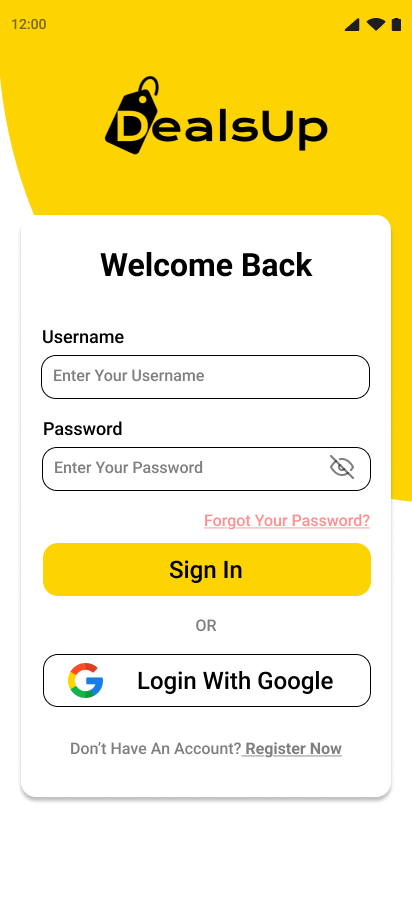
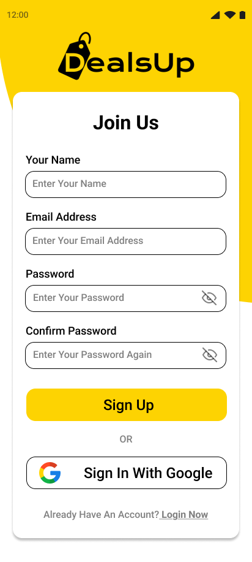
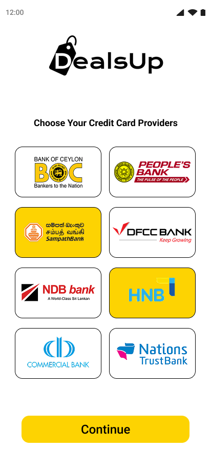
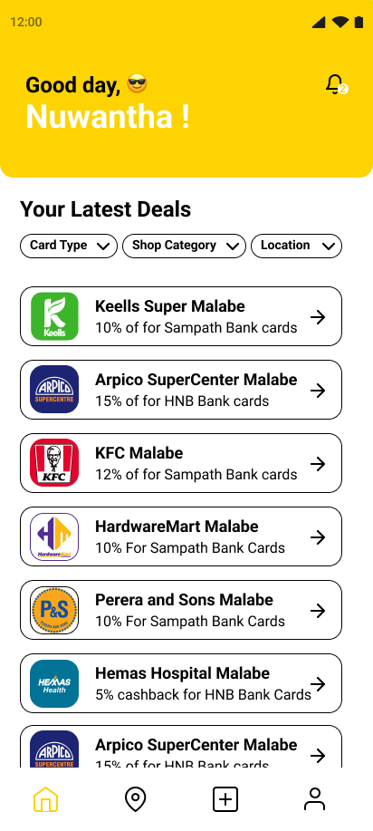
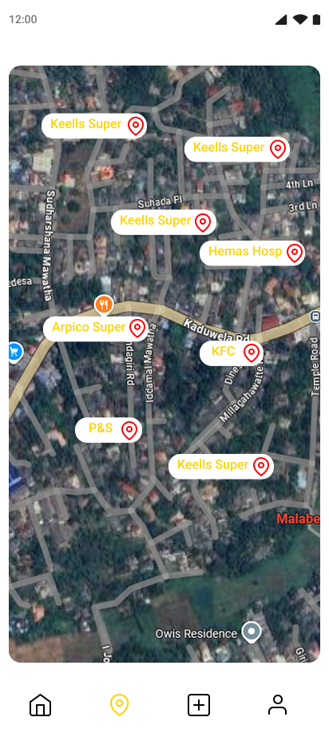
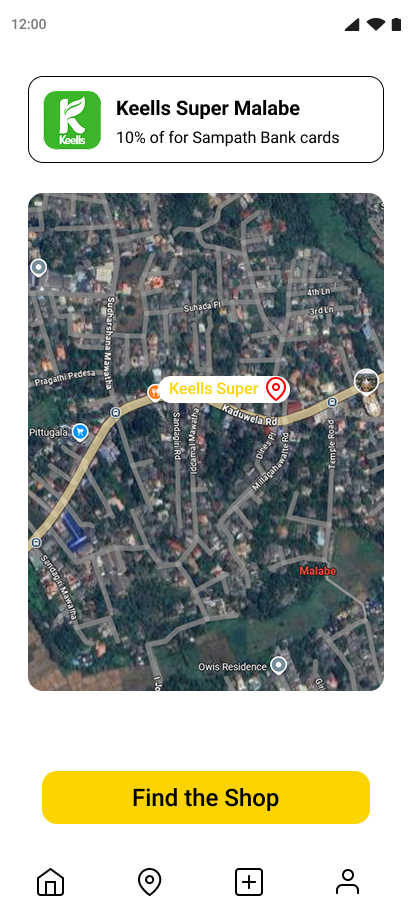
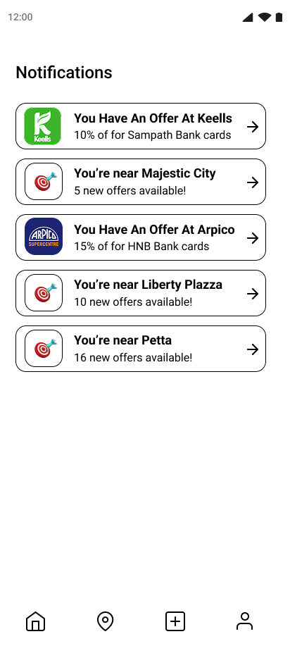
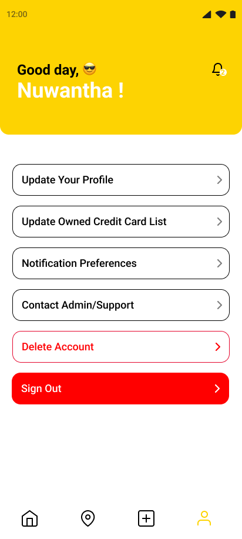
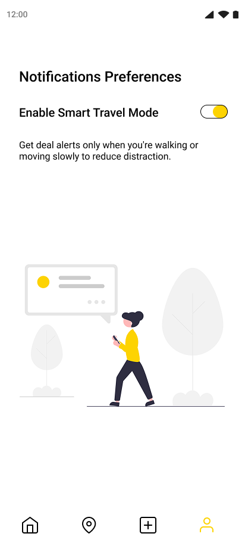
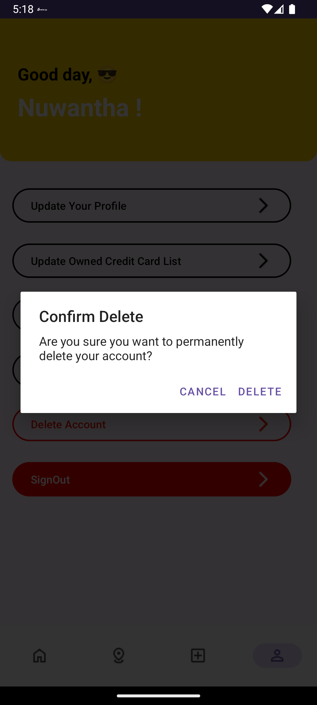

# 💳 DealsUp - Smart Credit Card Deal Finder

An Android mobile app that helps users discover real-time credit card offers and store deals based on their **location**, **motion**, and **bank card preferences**. Built using Firebase, Google Maps, and sensor APIs.

---

## 📌 Project Overview

This app includes:
- 🔐 **Secure login and signup** using Firebase
- 🗺️ **Smart location-based deal detection** with accelerometer integration
- 💳 **Card selection system** to filter deals relevant to the user
- 🔔 **Push notifications** (even when app is closed) for nearby deals
- 📬 **Notification history**, user preferences, and account management features

---

## 🎯 Key Features

✅ **Login & Auto Registration**  
- Firebase Authentication with email/password  
- Secure login + new user registration system  

✅ **Card Selection System**  
- Users can choose which credit cards they use  
- Deals filtered based on selected bank cards  

✅ **Smart Dashboard**  
- Filters by card type, category, and location  
- View personalized deals in a list  

✅ **Google Maps Integration**  
- See nearby deals on a map  
- Tap to view details and start navigation  

✅ **Sensor-Based Background Alerts**  
- Uses accelerometer to detect motion  
- Automatically notifies user if they are near a store with a deal  

✅ **Push Notifications + Notification Center**  
- Firebase Cloud Messaging (FCM) for alerts  
- View all received alerts on a notification screen  

✅ **Profile & Preferences**  
- Update profile, contact admin, delete account  
- Control notification and smart alert preferences  

---

## 🧪 Screenshots

| Welcome | Sign In | Sign Up |
|--------|---------|---------|
|  |  |  |

| Choose Cards | Dashboard | Map View |
|--------------|-----------|----------|
|  |  |  |

| Deal Card | Notification Popup | Notifications |
|-----------|--------------------|---------------|
|   |  |

| Profile | Preferences | Delete Account |
|---------|-------------|----------------|
|  |  |  |

---

## ⚙️ Technologies Used

| Area        | Tech Stack                           |
|-------------|---------------------------------------|
| Language    | Java (Android SDK)                    |
| Backend     | Firebase Authentication, Firestore    |
| Push Alerts | Firebase Cloud Messaging (FCM)        |
| Maps        | Google Maps API                       |
| Sensors     | Android Accelerometer API             |
| UI Layout   | XML (ConstraintLayout, RecyclerView)  |

---

## 🚀 How to Run the Project

1. Clone this repository:
   ```bash
   git clone https://github.com/Nuwantha2/DealsUp.git
